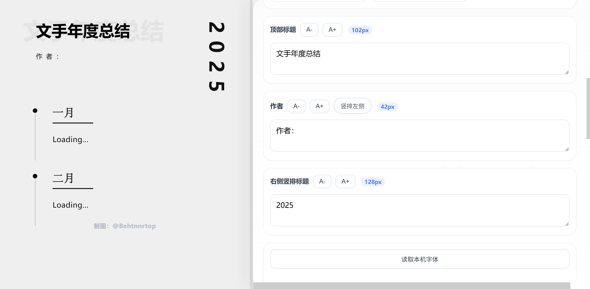
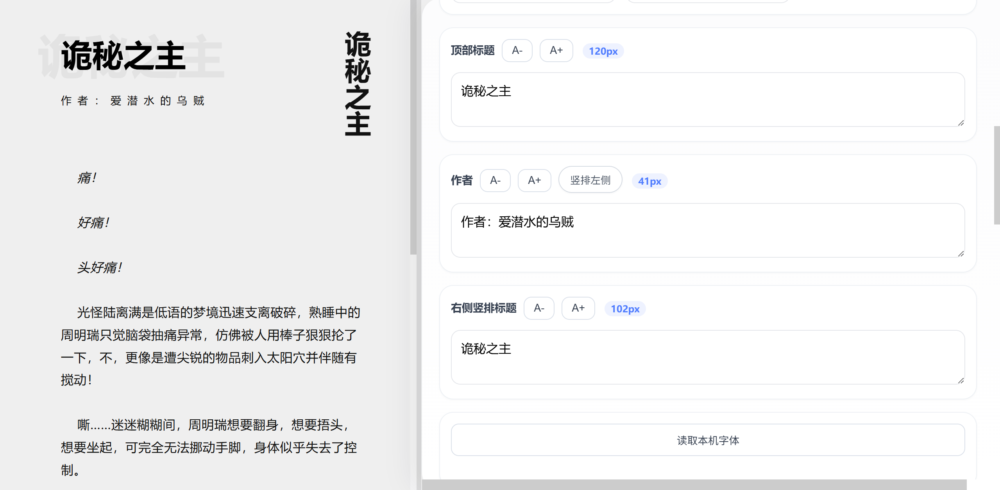

# Article Format

一个用于「文手排版」长图的网页小工具，更加清晰、简洁、美观，便于阅读，可直接在浏览器中运行。对移动端做了部分适配，但更推荐电脑查看。

## 功能特点

- 实时编辑标题、作者信息、右侧竖排标题和段落内容
- 支持新增、删除多个内容段落
- 支持富文本编辑，包括加粗、斜体、下划线、删除线和字体
- 支持调整标题字号、正文字号、行距、段落间距和模块间距
- 支持切换时间轴、段落标题、横线和竖排标题
- 支持背景色/图、文字颜色和字体设置
- 支持读取本机字体（需浏览器权限，推荐 Chrome 或 Edge）
- 支持手机分辨率预览
- 支持导出完整长图 JPG
- 支持按手机比例自动切图并导出 ZIP
- 编辑内容会自动保存在浏览器本地

## 使用方法

1. 打开 `index.html`
2. 在右侧编辑器中修改标题、作者、竖排标题和段落内容
3. 根据需要调整颜色、字体、字号、间距和显示选项
4. 点击 `导出长图JPG` 生成完整长图
5. 或点击 `导出已切图的JPG` 生成适合手机浏览的切图压缩包

访问地址：
```text
https://behtnnrtop.github.io/Article-format/
```

## 更新记录

查看 [CHANGELOG.md](CHANGELOG.md) 了解版本更新内容。

## 示例
可以作为文手的年度总结按月份/自定义标题展示：



也可以给自己的长文进行排版，在其他网站发布图片：



## 反馈
如果你有功能建议、使用反馈或问题报告，欢迎通过 [GitHub Issues](https://github.com/Behtnnrtop/Article-format/issues) 提交。

## License

本项目基于 MIT License 开源。
